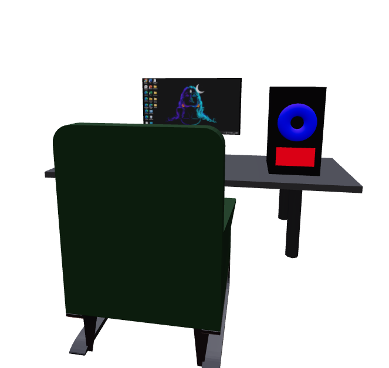

# 🖥️ 3D Computer Setup

An interactive 3D computer desk scene built with **React Three Fiber**, **Three.js**, and **Tailwind CSS**. This project visualizes a workspace with a monitor, CPU, mouse, keyboard, desk, and chair — all in 3D.

---

## 🔮 Preview



> 📝 Tip: Replace `preview.png` with your own screenshot (see instructions below).

---

## ✨ Features

- 📦 Modular 3D components: Desk, Monitor, Keyboard, Mouse, CPU, Chair
- 🎮 Interactive camera controls (OrbitControls)
- 🌇 Realistic lighting via HDR environment
- 📱 Responsive design with Tailwind CSS
- 🌀 Subtle animations using Framer Motion

---

## 🚀 Getting Started

### 1. Clone the Repo

```bash
git clone https://github.com/Mahadev422/computer-set.git
cd computer-set
